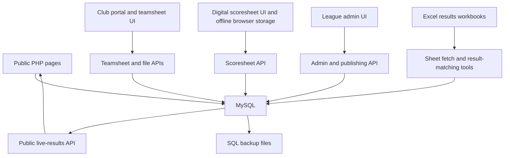

# Cotswold Swimming League Codebase Audit

**Audit date:** 10 August 2026

**Repository:** `/Volumes/cotswoldleague`

**Git baseline:** `2e936fbd645fce5821df7382d12752b1a77bcd48` (`main`, matching `origin/main` when the audit began)

**Audit type:** Repository-wide, read-only architecture, security, data-integrity, maintainability, documentation, and operational-artifact review

## Executive summary

This repository is a substantial league-management application, not only a public website. It covers:

- public league information, clubs, draws, standings, history, spectator information, and presentations;
- a PIN-protected club portal for contacts, venues, swimmers, teamsheets, and meet-day preparation;
- a shared league-administrator portal for clubs, seasons, draws, events, results, finals, and live publishing;
- offline-capable digital gala scoring, verification, live results, and publishing;
- spreadsheet import/export and an Excel-based results-calculator workflow;
- operational backups, documents, historical data, and uploaded results.

The system has useful functionality and several good defensive foundations, but it is **not currently safe to treat as a hardened production application**. The most serious problems are not cosmetic old-AI mistakes: they affect confidentiality and the integrity of official league results.

The four most urgent confirmed issues are:

1. Database backups containing personal and authentication data are committed to Git beneath the apparent web document root, without an Apache deny rule.
2. Any authenticated club can access and alter any non-final gala scoresheet if it can identify the scoresheet.
3. Official points, places, statuses, and submitted totals are calculated in the browser and accepted by the server without authoritative recalculation.
4. The swimmer-save API permits a club to update another club's swimmer record by supplying that record's numeric ID.

The recommended posture is: **contain the critical exposure and authorization issues before adding major new features**. The application can then be stabilized rather than rewritten. Its domain concepts and many of its workflows are worth retaining.

## Immediate remediation update — 10 August 2026

The original findings remain below as the audit baseline. The following containment work has now been implemented in the working tree but has **not yet been verified against the live server/database**:

- The repository owner deleted the tracked SQL backup files. `db_backups/` is now ignored to prevent accidental recommit.
- Apache rules now deny `db_backups`, `_legacy`, `scratch`, `scripts`, `Documents`, `config.local.php`, SQL, batch, backup, and Markdown files beneath the public project tree.
- Apache also denies executable script extensions beneath image and upload directories, containing the immediate code-execution risk from the legacy logo uploader without changing accepted club image formats.
- Preliminary scoresheets are restricted to the venue host; finals are restricted to the explicitly assigned finals recorder; league administrators retain access. Sandbox creation is administrator-only.
- The server now accepts only raw time/DQ inputs, verifies that the event and club belong to the editable scoresheet, and independently recalculates points, places, statuses, and totals after saves and again at submission, verification, and publication.
- The swimmer-save path validates every existing swimmer ID against the authenticated club and season before any write.
- The three confirmed `league_admin.php` parameter-binding signatures have been corrected.
- Club and administrator logins now rotate the PHP session ID immediately after successful authentication.
- The public club directory now escapes database content in HTML and map popups, constrains outbound club links to HTTP(S), isolates logo filenames, and safely encodes its JavaScript data.
- The draw importer now has an explicit CLI-only guard.
- A dependency-free security regression test covers the access matrix, scoring examples/dead heats, and source-level critical trust boundaries.
- A 100-case deterministic parity check confirmed that the new PHP scoring engine matches the existing JavaScript algorithm across pending, DQ, too-fast, valid, and tied results.
- Session-bound CSRF tokens are now enforced on club, administrator, scoresheet and teamsheet mutations; same-origin enforcement protects the remaining legacy/telemetry POST paths, and logout is POST-only.
- Remaining identified public/admin/scoresheet output paths now use context-appropriate escaping or safe URL/filename handling.
- Administrator logo uploads are size/type/dimension checked, decoded, re-encoded to WebP, randomly named, and retained beneath the existing non-executable image path.
- The general audit viewer is now administrator-only. Protected request paths write structured, secret-redacted request records with request IDs, and internal database errors are no longer returned by the reviewed APIs.
- Public club requests no longer geocode, alter schema or write coordinates. Geocoding is an explicit CLI operation with TLS verification, timeouts, coordinate validation, rate limiting and a failure report.
- Homepage, spectator, showcase, table and draw-adjacent output now use the active season. Historic finals/venue fallbacks have been replaced with database values or explicit “not published/to be confirmed” states.
- Mutable browser-CDN dependencies have been vendored at recorded versions and checksums under `assets/vendor/`; the scoresheet PWA cache was bumped to include the local assets.
- Workbook imports now produce a structural/schema/checksum compatibility report while continuing to accept structurally valid legacy unversioned workbooks.
- `security_headers.php` is the single CSP/header policy. Forwarding headers are honored only from explicitly configured trusted proxy IPs.
- A local/CI quality gate now lints every PHP file, validates JavaScript/JSON, runs scoring/security/source contracts, and checks patch whitespace.
- `README.md`, `WEBSITE_GUIDE.md`, the scoresheet record, this audit, and a new `OPERATIONS_RUNBOOK.md` document the current controls, deployment checks, rollover, geocoding, workbook compatibility, rollback and residual staged risks.

These changes intentionally preserve the existing browser calculation and offline payload shape so clubs retain immediate/offline feedback. Client-derived fields remain in the payload for backward compatibility but are ignored by the server.

The eleven follow-up findings above are corrected in the working tree with backward-compatible behaviour. Deployment-edge header checks, representative workbook checks and authenticated browser/database smoke tests remain required before treating them as live-verified.

## Scope and method

The pass covered all tracked source and operational files, plus the ignored local configuration that affects runtime behaviour. The repository contains 190 tracked files, including:

- 55 PHP files;
- 2 JavaScript files;
- 51 SQL snapshots;
- 24 Excel workbooks;
- 6 Markdown documents;
- 2 JSON files;
- the Apache configuration, pre-commit configuration, Windows backup script, images, uploads, and Word documents.

Approximately 25,472 lines of tracked PHP, JavaScript, Markdown, JSON, batch, and Apache configuration were reviewed. All PHP entry points, APIs, shared helpers, legacy pages, schema/bootstrap logic, JavaScript scoring/offline code, documentation, SQL schema/data classes, Word documents, and Excel workbook structures were inspected.

### Safe validation performed

- `php -l` passed for every PHP file, including active, scratch, legacy, and ignored local configuration files, using PHP 8.5.7.
- Both tracked JSON files parsed successfully.
- `git diff --check` passed.
- Both Word documents were rendered and every page visually inspected; neither contains comments or tracked changes.
- All 24 Excel workbooks were opened structurally. Formula counts, sheet structures, external links, macros, and obvious broken formula references were checked.
- No tracked file was modified during inspection.

### Deliberate boundaries

- No database connection was made and no migration, seed, geocode, publish, import, or write path was executed. Including `db.php` can mutate the database, so a runtime test without an isolated database would not have been safe.
- No production login, PIN, account, Cloudflare configuration, Apache virtual-host configuration, or live URL was tested.
- GitHub repository visibility and Git-history exposure were not verified. A GitHub remote exists, but its visibility is unknown.
- No security issue was exploited. Findings are based on direct source and data-path tracing.

## What the application does

### Users and roles

| User | Main capabilities | Authentication model |
|---|---|---|
| Public visitor | League information, club map, draw, standings, history, spectator material, selected live results | None |
| Club representative | Club contacts, venue information, swimmers, teamsheets, meet-day material, some scoresheet operations | Club selection plus shared four-digit PIN |
| Host/meet operator | Creates and records gala scoresheets, supports offline entry, submits results | Same club session; host distinction is only partially enforced |
| League administrator | Clubs, contacts, draws, venues, events, scores, verification, publishing, finals | One shared super-administrator password |
| Legacy administrator | Older contact, draw, venue, score, debug, and setup paths | Inconsistent; some pages have weaker or no protection |

### High-level architecture

There is no framework, package manager, application service layer, migration runner, test harness, or build pipeline. Most pages include `db.php` directly and combine routing, authorization, database operations, business rules, and HTML rendering in the same file.

## Code and artifact inventory

### Shared runtime and infrastructure

| File | Purpose | Audit notes |
|---|---|---|
| `db.php` | Loads local/environment configuration, opens MySQL, performs schema creation/alteration, reads the active season, seeds events, and defines shared passwords/import settings | It is both connection bootstrap and an implicit migration runner; merely including it may write to the database |
| `security_headers.php` | Sends security headers and starts sessions with strict mode, HttpOnly, SameSite, and conditional Secure flags | Useful baseline, but CSP permits inline/eval scripts and proxy-header trust is not restricted to a known proxy |
| `season_data.php` | Provides season standings/draw data and also performs schema/seed work | Read and write concerns are mixed |
| `finals_sync.php` | Creates finals venue rows and assigns teams based on standings | Season-aware, but incomplete-team and tie rules need correction/confirmation |
| `document_event_helpers.php` | Normalizes gala events for printable/programme documents | Useful centralization |
| `nav.php` | Shared navigation plus global offline-sync JavaScript | Offline data is not scoped by user/club/session |
| `printable_doc_toolbar.php` | Shared controls for printable meet documents | Presentation helper |
| `.htaccess` | Extensionless PHP rewriting and response security headers | Does not deny sensitive directories or file types |
| `manifest.json`, `sw.js` | Progressive web app metadata and scoresheet caching | Supports offline meet operation |

### Public website and presentation pages

| Files | Purpose |
|---|---|
| `index.php` | Homepage, next-season messaging/countdown, sponsor and Facebook integration |
| `clubs.php`, `geocode_init.php` | Club directory, map, directions, and automatic postcode geocoding |
| `season-draw.php` | Preliminary/finals draw, venue information, teamsheets, results, and selected live views |
| `table.php`, `showcase.php` | League standings and display/showcase views |
| `showcase_presentation.php`, `showcase_finals_presentation.php` | Full-screen presentation modes |
| `history.php` | Historical results/archive presentation |
| `spectators.php`, `spectator-programme.php` | Spectator guidance and gala programme |
| `join.php`, `privacy.php` | Membership/entry information and privacy notice |
| `gala_live_public_api.php` | Public JSON for explicitly enabled, in-progress live scoresheets |

### Club portal and teamsheets

| Files | Purpose |
|---|---|
| `teamportal.php` | PIN login, club contacts/PINs, venue management, directory, host checklist, teamsheet UI entry point |
| `digital-teamsheets.php` | Teamsheet workspace/wrapper, including admin embedding |
| `digital_teamsheet_api.php` | Swimmer imports/edits, teamsheet creation/edit/submission, sharing, upload metadata, and audit snapshots |
| `digital_teamsheet_export.php` | Generates teamsheet exports |
| `digital_teamsheet_file.php` | Authenticated download/preview of privately stored teamsheets |
| `fetch_sheet.php` | Retrieves a configured Google Sheet/CSV source |

### Gala scoring and league administration

| Files | Purpose |
|---|---|
| `league_admin.php`, `admin.php` | Main super-administrator portal and compatibility entry point |
| `admin_gala_events.php`, `admin_gala_results.php` | Focused event/results admin views |
| `gala_scoresheet.php`, `gala_scoresheet.js` | Meet-day score entry, client scoring, offline behaviour, verification UI, and leaderboard |
| `gala_scoresheet_api.php` | Scoresheet CRUD, teams, result saving, live toggle, submission, and venue lookup |
| `gala_admin_api.php` | Verification, rejection, and round publishing into the main standings |
| `gala_seed_events.php` | Default event definitions |
| `update_scores.php` | Older direct round-score editor with its own fallback password |
| `track_action.php`, `audit_log.php` | Lightweight tracking counter and venue audit-log viewer |

### Meet-day printable and matching tools

| Files | Purpose |
|---|---|
| `Announcers-guide.php` | Announcer running guide |
| `ChiefTKSlips.php` | Chief timekeeper slips |
| `Officials Sign-in.php` | Officials attendance/sign-in sheet |
| `Timekeeper-sheets.php` | Lane timekeeper recording sheets |
| `smartprogrammenew.php` | Programme builder/output |
| `smart-results-matcher.php` | Spreadsheet/result matching and reconciliation aid |

### Operational scripts, documents, and data

| Path | Purpose | Audit notes |
|---|---|---|
| `scripts/db_backup.bat` | Windows `mysqldump` automation | Uses a privileged local database account and writes unencrypted dumps to a synced/web-project directory; no retention or restore verification |
| `scratch/import_2027_draw.php` | One-off draw import | Intended for CLI, but the directory is not denied at the web-server layer |
| `scratch/check_schema.php` | Schema diagnostic | Should not be web-accessible |
| `db_backups/*.sql` | 51 historical database snapshots | Contains personal data, swimmer records, and access data; tracked and apparently under the document root |
| `Documents/Cotswold League Brand Guidelines.docx` | 2026 brand palette, UI style, voice, logo, and sponsor guidance | Four pages, readable, but season-specific and visually plain; no comments/redlines |
| `Documents/Cotswold League Website - Development & Setup Recap.docx` | Original architecture, hosting, maintenance, and recovery guide | Five pages and materially stale; it claims completeness/security that the current code does not support |
| `Documents/Cotswolds Gala Results Calculator 2027.xlsx` | Eight-sheet, formula-driven calculator template for two to eight teams/finals | 4,395 formulas; no macros, external links, or obvious `#REF!`/`#NAME?` formula strings |
| `uploads/results/*.xlsx` | 23 completed round/final operational workbooks | Typically 4,266-4,381 formulas; one has only two sheets and one contains an extra generic `Sheet1`, indicating template/process drift |
| `uploads/results/finals_teamsheets.json` | Finals teamsheet metadata | Valid JSON |

### Legacy code

`_legacy/` contains ten older pages: result matcher, contacts, club/schema debug pages, draw/venue editors, scratch, tracking setup, and programme code. These files are still PHP-addressable if the directory is beneath the production document root. Some expose schema/data, some mutate the database, and their authentication/include assumptions differ from the current application. They should be archived outside the served tree, not merely labelled legacy.

## Data model

The latest inspected SQL snapshot defines 14 principal tables:

| Table | Purpose | Key observations |
|---|---|---|
| `global_settings` | Active season and global values | Runtime inserts defaults |
| `clubs` | Club identity, venue basics, logo, web/map information, active state | Publicly rendered data needs consistent escaping/URL validation |
| `club_contacts` | Club contacts and access PIN | PIN is stored in plaintext |
| `venue_details` | Season/round/final host, teams, dates, documents, and results | Team slots are denormalized columns; several IDs lack foreign keys |
| `results` | Four round totals and derived season total | Code assumes one row per club/season, but the snapshot lacks the matching unique constraint |
| `gala_events` | Season-specific event definitions and cut-off times | Admin binding errors threaten create/update operations |
| `gala_scoresheets` | Meet instance, workflow state, public-live flag, submitted totals | Submitted totals are client-supplied; venue uniqueness is not enforced |
| `gala_teams` | Clubs and lanes within a scoresheet | Central to scoring authorization/validation |
| `gala_results` | Event/club time, DQ, verification, points, place, status | Server accepts derived values from the client |
| `club_swimmers` | Club/season swimmer name, age group, PBs, availability | Contains youth data and has a cross-club IDOR in its save path |
| `club_teamsheets` | Club/round submission metadata and uploaded document path | Needs stronger venue/round authorization and uniqueness rules |
| `club_teamsheet_entries` | Event selections, PB snapshot, notes | Swimmers are stored as names in JSON rather than stable record references |
| `club_teamsheet_audit` | Post-submission change reason and snapshots | Positive control, but snapshots increase sensitive-data retention |
| `audit_log`, `tracking_stats` | Venue-change audit and lightweight action counts | Coverage is partial and access/retention need review |

## Findings

Severity definitions:

- **Critical:** plausible direct compromise of personal data or official results; contain before normal feature work.
- **High:** serious security, integrity, or operational failure likely under realistic conditions.
- **Medium:** important resilience, privacy, maintainability, or correctness debt.
- **Low:** quality or future-drift issue with limited immediate impact.

### Critical findings

#### C-01 — Database backups expose personal and authentication data

**Evidence:** `db_backups/` contains 51 tracked SQL dumps. The snapshots include club contact details, plaintext access PINs, and swimmer names, dates of birth/age information, PBs, and availability. The root `.htaccess:1-24` disables directory listing but does not deny `db_backups`, `.sql`, `_legacy`, `scratch`, or `Documents`.

**Impact:** If the repository is the Apache document root described by the operating documentation, a guessed backup filename may be downloadable even though directory indexes are disabled. The same data also exists in Git history and may have been copied to GitHub. This is a personal-data incident risk involving children and access credentials.

**Required action:**

1. Immediately deny access to backup/data/source-only paths and extensions at Apache/Cloudflare, then verify from outside the network.
2. Move backups outside the document root and outside Git; encrypt them, define retention, and test restoration.
3. Rotate every club PIN and all database/application credentials that may appear in any snapshot or repository version.
4. Establish whether the GitHub repository or any backup URL has ever been publicly accessible; review web/Cloudflare/GitHub logs and follow the club's data-incident process if exposure cannot be ruled out.
5. Remove the dumps from the current tree and purge sensitive history using an agreed, backed-up Git-history procedure.

#### C-02 — Every club can access non-final scoresheets

**Evidence:** `gala_scoresheet_api.php:28-35` returns `true` for every authenticated club whenever the venue is not a final. That helper protects loading and all consequential mutations, including result saves, team changes, live publication, and submission.

**Impact:** A club account can read or alter another host's preliminary-round scoresheet by obtaining or enumerating its ID. This violates least privilege and undermines result integrity and the privacy statement's authorized-club assurances.

**Required action:** Authorize against the actual host/operator assignment for every action. Deny by default. Centralize an action-aware policy such as `view`, `record`, `submit`, `verify`, `publish`, and test positive and negative cases for host clubs, participating clubs, finals operators, administrators, and public users.

#### C-03 — The server trusts browser-calculated official scores

**Evidence:** `gala_scoresheet.js:85-142` calculates classification, points, and places. `gala_scoresheet_api.php:574-659` accepts `points`, `place`, `status`, verification flags, event IDs, and club IDs from single and batch client requests and writes them directly. Submission stores client-provided `total_points_json` (`gala_scoresheet_api.php:698-708`), and publishing aggregates that JSON (`gala_admin_api.php:153-195`).

**Impact:** A crafted request or corrupted/stale offline queue can fabricate points, placements, totals, and standings without changing recorded times. Browser JavaScript cannot be an authoritative trust boundary.

**Required action:** Treat the client as an input device only. The server must validate scoresheet membership, event membership, club membership, time/DQ inputs, permissible workflow transition, and operator authorization; then calculate status, place, points, tie rules, and totals in one tested server-side domain service. Recalculate again during verification/publish and reject any mismatch.

#### C-04 — Cross-club swimmer record update (IDOR)

**Evidence:** `digital_teamsheet_api.php:836-905` accepts a client-supplied swimmer primary key and performs `INSERT ... ON DUPLICATE KEY UPDATE`. The duplicate branch updates the existing row's swimmer fields but does not verify or update `club_id`. Supplying another club's ID therefore updates that other club's record.

**Impact:** Any authenticated club can corrupt another club's youth/swimmer data if it learns or guesses an ID.

**Required action:** Separate create and update. Generate IDs server-side for creates. For updates, use `UPDATE ... WHERE id = ? AND club_id = ? AND season_year = ?`, require one affected row, and return a generic not-found/forbidden response otherwise. Add negative authorization tests.

### High findings

#### H-01 — Shared, plaintext, weak, and fallback credentials

- Club authentication compares a four-digit PIN directly in SQL (`teamportal.php:22-38`) and saves replacement PINs in plaintext (`teamportal.php:124-136`).
- New clubs can receive a predictable default PIN (`league_admin.php:77-85`).
- The administrator uses a single shared password, and `db.php:299-300` contains functional fallback values in tracked source.
- `update_scores.php:10-14` has a second hardcoded fallback and then places it into a hidden form field (`update_scores.php:93-95`).
- The ignored `config.local.php` contains live-looking plaintext database/application secrets under the served project directory. Values are intentionally not reproduced in this report.
- There is no login throttling, lockout, per-user identity, MFA, session regeneration after login, idle expiry, or individual accountability.

**Action:** Replace shared secrets with named user accounts and role/club memberships, use `password_hash`/`password_verify`, require strong credentials and MFA for administrators, regenerate session IDs at authentication, add rate limits and expiry, remove all tracked fallbacks, disable the separate score-editor password path, and move secrets outside the served tree into protected environment/configuration storage. Rotate existing values.

#### H-02 — Authenticated mutations have no CSRF protection

No anti-CSRF token or origin enforcement was found in the club portal, admin portal, or JSON/form APIs. Logout is also a GET action in `teamportal.php:8-12` and `league_admin.php:8-12`. SameSite=Lax is a helpful secondary control but is not a complete CSRF defense, especially against same-site compromise or future deployment changes.

The documentation's claim that `track_action.php` performs origin/token validation is inaccurate; the implementation only checks POST shape and updates a counter.

**Action:** Add a session-bound token to every state-changing form/API request, verify it with `hash_equals`, use POST for logout, and validate Origin/Referer as defense in depth.

#### H-03 — Stored XSS and unsafe URL output paths

Database values are inserted without context-appropriate escaping in public views, notably `clubs.php:79-97` and its JavaScript popup template at `clubs.php:126-135`, plus preliminary-draw and table/showcase paths. Club website URLs are not restricted to safe schemes. Similar HTML-template construction exists in meet-day JavaScript.

An administrator edit, CSRF, compromised account, imported spreadsheet, or existing malformed database value could become stored script execution. The CSP permits `'unsafe-inline'` and `'unsafe-eval'` (`security_headers.php:33` and `.htaccess:21-23`), so it provides little protection against these paths.

**Action:** Escape every output by context (`htmlspecialchars` for text/attributes, JSON encoding for JavaScript data), build DOM nodes with `textContent`, validate URLs to `https`/`http`, and progressively move scripts/styles to nonce- or hash-based CSP without eval.

#### H-04 — Logo upload can place arbitrary extensions in an executable web directory

`league_admin.php:47-55` and `league_admin.php:99-107` derive the output extension from the original filename, do not validate MIME, size, or decoded image content, and write beneath `images/Teams/`.

**Impact:** An authenticated administrator—or a CSRF request in an administrator session—may upload a PHP/script file into a web-served directory. Depending on Apache configuration, this can become remote code execution.

**Action:** Allow only known image types, check size and magic bytes, decode and re-encode images, generate random server filenames, store outside executable locations, and explicitly deny script execution in upload/asset directories.

#### H-05 — Runtime requests perform migrations and seed operations

`db.php:47-297` creates tables, inserts settings, repeatedly attempts `ALTER TABLE`, updates rows, and seeds events on normal includes. Exceptions from many alterations are swallowed. `season_data.php` performs additional schema/seed work. One column alteration is duplicated (`db.php:88-98`).

**Impact:** Public requests require DDL privileges, deployment drift is hidden, failures can partially apply, response latency/locking can occur, and read-only testing is unsafe.

**Action:** Introduce versioned, transactional where possible, one-time migrations with a schema-version table and deployment command. The runtime database account should not have DDL privileges.

#### H-06 — Public club-page GETs can alter the database and make insecure external requests

`clubs.php` includes `geocode_init.php`. That file may add columns, calls external geocoding services for all missing clubs, writes coordinates, sleeps in the request, and disables TLS peer verification (`geocode_init.php:5-63`).

**Impact:** Public traffic triggers mutation and third-party dependency/rate-limit latency. Disabled certificate verification permits tampered geocoding responses.

**Action:** Move geocoding to an authenticated admin action or scheduled CLI job, restore TLS verification, add bounded timeouts/retries, validate results, and cache/report failures.

#### H-07 — Confirmed `bind_param` signatures break club/event administration

- `league_admin.php:59` provides nine type characters for eight variables. The correct shape is five strings, two doubles, and an integer. Club update will throw under modern PHP.
- `league_admin.php:355-358` has the correct number of types but assigns integer/string types to the wrong A-final fields.
- `league_admin.php:420-423` shifts `event_type`, cut-off, and A-final types; event creation can fail or coerce incorrect data.

These are characteristic generated-code mistakes that syntax checking cannot detect.

**Action:** Correct the signatures and add database-backed integration tests for every admin create/update path using an isolated fixture database.

#### H-08 — Legacy and scratch PHP remains web-addressable

The root server rules do not deny `_legacy/` or `scratch/`. Legacy debug pages expose data/schema, the old tracking setup mutates the database without current authorization, and several old include paths/authentication assumptions are broken or weaker. The draw import is intended for CLI but has no explicit `PHP_SAPI === 'cli'` guard.

**Action:** Move these files outside the document root or deny the directories immediately. Retain required scripts in a dedicated CLI directory with explicit CLI guards and authenticated operational documentation.

#### H-09 — Teamsheet submissions trust identifiers and eligibility supplied by the browser

`digital_teamsheet_api.php:911-965` accepts season, round, gala type, venue ID, event IDs, selected swimmer names, PB snapshots, and notes without proving that:

- the venue/round belongs to the club and active season;
- the event belongs to that season/meet;
- selected swimmers belong to that club and are active;
- age, gender, availability, event-count, and other league eligibility rules are satisfied.

Saving is not wrapped in a transaction and omitted events are not deleted, so a partially failed save or removed event can leave stale entries.

**Action:** Resolve all trusted entities server-side, validate the complete teamsheet against explicit league rules, save atomically, delete/replace the authoritative entry set, and return structured validation errors.

#### H-10 — Season mixing can display plausible but wrong public information

- `table.php` reads the active season but contains hardcoded 2026 finals results, venues, and notes.
- `spectators.php` queries results and venues without a season filter and labels material as 2026.
- `showcase.php` queries results without a season filter.
- `index.php` hardcodes the 2027 season and finals date instead of using the database.
- `season-draw.php` contains a hardcoded historical finals fallback.
- Footers and defaults mix 2026 and 2027.

**Impact:** At rollover, old and new rows can be combined or a fallback can look authoritative even when the database is incomplete.

**Action:** Make an explicit selected/active season mandatory in every query and route. Store season metadata centrally, remove plausible hardcoded operational fallbacks, and add rollover regression tests.

#### H-11 — Offline queues are not scoped to the authenticated operator

`nav.php` installs synchronization logic globally for localStorage/IndexedDB queues, while the score UI supports delayed batch mutation. Stored items are not partitioned by user, club, scoresheet authorization epoch, or session. On a shared meet laptop, a later login can sync a previous operator's pending work. There is also no version/optimistic-lock check for two operators editing the same event.

**Action:** Namespace and encrypt/safeguard offline state by club, scoresheet, user, and server-issued sync token; invalidate it on logout/role change; require server reauthorization for every replay; make requests idempotent; and add record version/conflict handling.

#### H-12 — Missing relational constraints permit duplicates and drift

The inspected schema lacks several constraints assumed by the PHP logic, including a unique club/season row in `results` and an enforced one-scoresheet-per-venue relationship. Venue team slots and some finals/source/teamsheet IDs lack foreign keys. Dates and PBs use free-form strings, and derived totals are stored separately from their component rounds.

**Action:** Design and migrate constraints after first detecting/repairing existing duplicates. Normalize team participation, use typed dates/times, add foreign keys/indexes, and decide which derived values are calculated versus persisted with invariant checks.

### Medium findings

#### M-01 — Finals synchronization can claim success with incomplete B/C finals

`finals_sync.php:94-106` only requires eight ranked clubs but slices 8 + 6 + 6 positions. With fewer than 20 eligible clubs, lower finals are padded with empty lanes while the operation proceeds. Ties are broken alphabetically (`finals_sync.php:77-82`), which may or may not match league rules.

**Action:** Define the minimum/variable finals allocation and tie-break rules explicitly with league officers, encode them once, and test boundary counts and tied standings.

#### M-02 — Partial audit coverage and weak operational observability

Venue edits and post-submission teamsheet changes have useful audit records, but club/contact/PIN/event/result/verification/publish actions are not consistently logged with an actor, reason, before/after values, request ID, and source. A club session can view the general audit log. Some authenticated error responses include database exception details.

**Action:** Introduce structured, append-only audit events for every consequential action; restrict viewing; redact sensitive values; establish retention; and separate user-safe errors from server logs/alerting.

#### M-03 — No automated test suite or CI quality gate

No PHPUnit/Pest suite, browser tests, static analyzer configuration, dependency manifest, or CI workflow was found. The pre-commit configuration performs generic lint/format/spelling checks but cannot detect authorization, binding, scoring, season, or transaction bugs.

**Action:** Build an isolated MySQL test fixture and start with invariant/security tests for C-02 through C-04, scoring examples, admin CRUD, season rollover, teamsheet validation, finals allocation, and public-data filtering. Add PHPStan/Psalm and CI.

#### M-04 — Unpinned browser dependencies and no reproducible build

Pages load Tailwind's runtime CDN, unpkg resources including `@latest`, SheetJS/CDN libraries, fonts, and other scripts without a lockfile or subresource integrity. Availability and behaviour can change independently of a deployment; Tailwind's runtime approach also drives unsafe CSP requirements.

**Action:** Adopt a small locked build/vendor process, self-host production assets where practical, pin versions and hashes, generate a minimal CSS bundle, and maintain a dependency/update register.

#### M-05 — Privacy controls do not match the sensitivity of the stored data

The privacy page recognizes swimmer data, dates of birth, teamsheets, and local storage, but there is no implemented retention/deletion schedule for database rows, audit snapshots, Git history, backups, uploads, or offline browser data. Public pages embed or call third-party services without a complete disclosure/control model.

**Action:** Complete a data inventory and lawful-basis/retention assessment; minimize DOB/PB/availability use; define deletion/export/incident procedures; update the notice; and ensure technical access controls match its claims.

#### M-06 — Spreadsheet result artifacts have template drift

The workbooks contain thousands of formulas and no macros/external links or obvious broken reference strings, which is positive. However, they are large copies of multiple unused team-count templates. One result workbook contains only its instruction and four-team sheet; another contains an extra generic `Sheet1`; finals and later-round outputs have differing tab sets/names. The PHP matcher therefore depends on heuristics around mutable workbook layouts.

**Action:** Version the workbook schema/template, embed a machine-readable template version, define the authoritative input/output sheet, validate formulas and expected cells before import, retain immutable originals, and generate a normalized import report/checksum.

#### M-07 — Documentation is stale and overstates security/completeness

The Word setup recap describes obsolete filenames and claims the backup directory is safe and the audit system covers changes. `WEBSITE_GUIDE.md` describes fewer tables than now exist, and `README.md` remains centered on an earlier season/workflow. The operational documents are useful historical context but cannot be treated as the current runbook.

**Action:** Replace the “complete record” claim with versioned architecture, deployment, backup/restore, season-rollover, meet-day, security, and incident runbooks tied to code/database versions.

#### M-08 — Header/proxy and CSP configuration needs deployment validation

`security_headers.php:8-12` trusts forwarding headers without checking that the request came from a known proxy. Apache and PHP duplicate CSP/header definitions. The current CSP appears incompatible with the homepage Facebook SDK domain while still allowing broad inline/eval execution.

**Action:** Establish one authoritative header layer, sanitize forwarding headers at Cloudflare/Apache, trust only the known proxy path, test headers from the public edge, and add automated CSP/report-only checks before tightening.

### Low findings and quality debt

- Dates, season labels, sponsor copy, and footer years are repeated across many templates, making rollover drift likely.
- Several PHP files close with `?>`; omitting it in PHP-only helpers reduces accidental output risk.
- Naming and casing are inconsistent (`ChiefTKSlips`, `Officials Sign-in`, `smartprogrammenew`, hyphen/underscore mixes), which complicates Linux deployment and routing.
- Large pages mix controller, SQL, validation, HTML, and JavaScript, making review and testing difficult.
- Some comments assert properties such as “mirrors Excel exactly” without a shared specification or automated cross-check.
- The Word documents render legibly but use weak heading structure/page flow and season-specific language, reducing long-term maintainability.

## Positive controls worth preserving

The audit also found sound work that should form the base of remediation:

- Prepared statements are used across many sensitive data paths.
- Session cookies enable strict mode, HttpOnly, SameSite=Lax, and Secure when HTTPS is detected.
- Baseline security headers remove `X-Powered-By`, deny framing by default, and set content/referrer/permission controls.
- Private uploaded teamsheets are protected by a directory deny file and served through an authenticated path with realpath containment; upload size, extension, and MIME checks are materially better than the logo flow.
- Public live results require an explicit live flag and in-progress state.
- Club venue updates are generally scoped to the logged-in club and active season.
- Inactive clubs are retained for history instead of being destructively deleted.
- Post-submission teamsheet edits require a reason and create snapshots.
- Some publishing operations use database transactions and validate allowed dynamic column names.
- Event/finals helpers are season-aware in several newer paths.
- PHP syntax is clean and the repository is internally organized enough to stabilize incrementally.

## Recommended remediation plan

### Phase 0 — Containment (same day)

1. Block public access to `db_backups`, `_legacy`, `scratch`, `Documents`, local config, dotfiles, SQL files, and non-public uploads; verify from an external connection.
2. Move/secure backups and local secrets, rotate all PINs/passwords/tokens/database credentials, and assess prior exposure.
3. Disable or restrict the legacy score editor and legacy/debug/setup endpoints.
4. Restrict scoresheet access to the assigned host/operator and super-administrator.
5. Stop accepting client-derived points, places, statuses, verification flags, and totals; if the server calculation cannot be deployed immediately, temporarily prevent publishing through the vulnerable workflow.
6. Patch the swimmer update IDOR.

### Phase 1 — Security and integrity stabilization (first 1-2 weeks)

1. Add server-side scoring with golden examples from the approved league rules/Excel calculator.
2. Add action-aware authorization and CSRF protection everywhere.
3. Correct admin binding bugs and add integration tests for club/event CRUD.
4. Validate/atomically replace complete teamsheets and enforce club/season/venue/event/swimmer ownership.
5. Escape public/admin output, validate URLs, and secure logo uploads.
6. Scope and version offline queues; add idempotency and conflict handling.
7. Add emergency regression tests for every critical/high issue.

### Phase 2 — Platform hardening (weeks 2-6)

1. Extract versioned migrations and reduce runtime database privileges.
2. Add/repair unique constraints, foreign keys, typed dates/times, and normalized participation relationships.
3. Replace shared passwords/PINs with named identities, memberships, roles, MFA, session expiry, and complete auditing.
4. Centralize season context and remove hardcoded operational fallbacks.
5. Lock/self-host dependencies and tighten CSP.
6. Add CI, static analysis, isolated DB tests, and browser tests for public, club, host, and admin journeys.

### Phase 3 — Operational resilience and maintainability

1. Create current architecture, deployment, backup/restore, rollover, meet-day, incident, and data-retention runbooks.
2. Add structured logs, monitoring, health checks, backup alerts, restore drills, and operational ownership.
3. Version and validate the Excel exchange format or replace it with a stable import/export contract while retaining human-readable workbooks.
4. Gradually separate HTTP controllers, authorization, validation, domain/scoring services, repositories, and views. A full rewrite is not required.

## Suggested first implementation backlog

| Order | Work item | Acceptance evidence |
|---:|---|---|
| 1 | Web-root containment and credential rotation | External requests return deny/not-found; rotation register completed; no sensitive data remains in served paths/current Git tree |
| 2 | Scoresheet authorization policy | Automated allow/deny matrix for every role/action/venue type |
| 3 | Authoritative server scoring | Golden rule examples match approved workbook/rules; tampered client values are ignored/rejected |
| 4 | Swimmer ownership patch | Cross-club ID test fails safely; own-club create/update still passes |
| 5 | CSRF and session hardening | All mutations reject missing/wrong token; session ID changes at login; logout is POST |
| 6 | Admin CRUD repair | Isolated DB tests create/update clubs and every event-field combination |
| 7 | Teamsheet validation/transactions | Invalid venue/event/swimmer/eligibility cases reject; removal leaves no stale rows; rollback test passes |
| 8 | Output/upload hardening | XSS regression payloads render inert; unsafe URLs/files reject; upload directories cannot execute PHP |
| 9 | Migration and schema constraints | Fresh install and upgrade both pass; runtime account cannot execute DDL |
| 10 | Season rollover and public correctness | Every public query/view passes current, historical, empty, and future-season fixtures |

## Known unknowns requiring live or stakeholder verification

- Whether Cloudflare Access, WAF rules, or Apache virtual-host rules already block sensitive paths independently of the repository `.htaccess`.
- Whether the GitHub remote has ever been public, forked, cloned by third parties, or exposed through CI/artifacts.
- Whether current production schema/data has drifted from the latest tracked snapshot.
- The authoritative league scoring, too-fast, DQ, dead-heat, absence, tie-break, and finals-allocation rules.
- Which club(s) may operate a preliminary scoresheet and whether more than one named operator should have access.
- Required retention periods and lawful basis for swimmer DOB/PB/availability, teamsheets, uploads, audit snapshots, and backups.
- Whether public pages currently exhibit CSP failures, mobile/print problems, or CDN/offline failures; source review cannot replace browser testing against an isolated runtime.
- Recovery time/recovery point objectives and whether any database restore has been tested.

## Audit conclusion

The older-model origin is visible in duplicated logic, optimistic comments, mismatched parameter signatures, client-trusted business rules, hardcoded seasons, and documentation that describes intent as if it were enforced. However, the repository also captures valuable league knowledge and operational workflows. The best path is a controlled stabilization: contain the four critical issues, make scoring and authorization server-authoritative, introduce tests/migrations, then continue feature development on that safer base.

This file is the initial audit baseline. Findings should be checked off only with code changes **and** the acceptance evidence listed above; a source-only fix is not sufficient for public, authentication, scoring, backup, or browser-visible changes.
